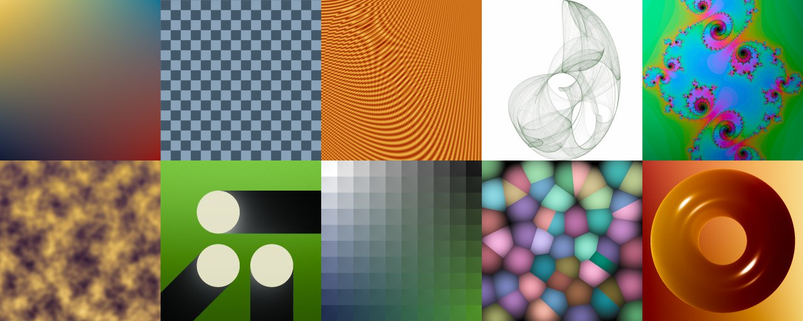

# zig-generative-template
Zig framework for generating png images (single or multiple frames.)




# Features
1. Perceptual uniform color space (JzAzBz)
2. [XKCD's 954 most common colors](https://xkcd.com/color/rgb/)
3. [Disney](https://google.github.io/filament/Filament.html#materialsystem/standardmodelsummary) [BRDF](https://en.wikipedia.org/wiki/Bidirectional_reflectance_distribution_function)
4. [2D](https://www.iquilezles.org/www/articles/distfunctions2d/distfunctions2d.htm) and [3D](https://www.iquilezles.org/www/articles/distfunctions/distfunctions.htm) signed distance fields/functions
5. [Simplex Noise](https://en.wikipedia.org/wiki/Simplex_noise) for 1D, 2D, 3D, 4D inputs
6. [Squirrel3 noise & randomization](https://youtu.be/LWFzPP8ZbdU?list=FLOZKYzNJILemcDKZwSBSoyg&t=2817)
7. [Filmic Color Grading](http://filmicworlds.com/blog/minimal-color-grading-tools/) and Lift/Gamma/Gain
8. [Supersampling anti-aliasing](https://en.wikipedia.org/wiki/Supersampling) (SSAA)
9. Implicit surfaces for spheres, ellipsoids, torus, elliptical torus, and plane
10. Memory limits and measurement
11. Fast low-res previews and slow high-res renders


# Usage
```
zig build run
```

Or if you have [entr](https://eradman.com/entrproject/) installed:
```
./autopng.sh
```
to automatically rebuild and regenerate out/out.png each time the main.zig is saved.


# Example Code
```
pub fn main() !void {
    try renderer.render(.{
        .Shader = SimpleBlendShader,

        .preview = true,
        .memoryLimitMiB = 128,
        .ssaa = 3,
        .preview_ssaa = 1,
        .preview_samples = 600000,
        .frames = 1,

        .path = "out/out.png",
        .frameTemplate = "out/frame-{d:0>6}.png",

        .res = Resolutions.Instagram.portrait,
    });
}

const SimpleBlendShader = struct {
    const Self = @This();

    // Put per-frame state here.
    time: f64,

    pub fn init(allocator: *Allocator, config: renderer.ShaderConfig) !Self {
        // Stuff to do once before rendering any pixels. Config includes the
        // resolution of the frame, the frame number, and the current time.
        return Self{
            .time = config.time,
        };
    }

    pub fn deinit(self: *const Self, allocator: *Allocator) void {
        // Stuff to do after rendering all the pixels (and before the next frame.)
    }

    pub fn shade(self: *const Self, x: f64, y: f64) Jazbz {
        // Decide on the color of the pixel at x,y.
        return mix(
            mix(colors.goldenYellow, colors.seaBlue, saturate(x)),
            mix(colors.navyBlue, colors.bloodRed, saturate(x)),
            saturate(y),
        );
    }
};
```
